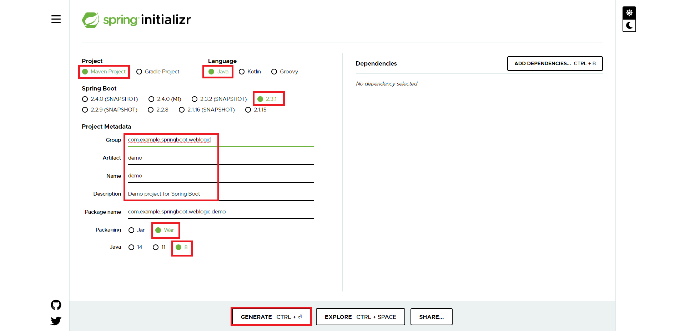

# Welcome to Springboot On WebLogic Hands On Lab

This Hands On Lab will cover on creating simple Springboot project that will be deployed on top of WebLogic Server. For this purpose we will create simple hellow world page only.

## Create Spring Project

To start springboot project the easiest way is by creating the project in [Spring Initialzr](https://start.spring.io/) all that need to be done is filling some criteria, for this lab we will fill it like below:

The above generate button will give you .zip project file that can be extracted and imported to your personal development tools
